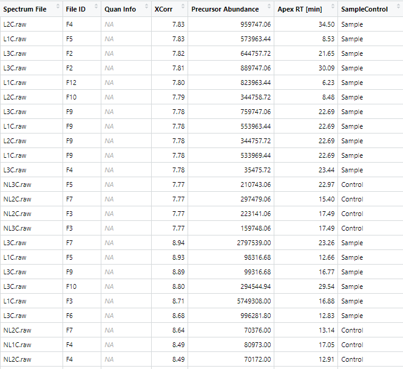
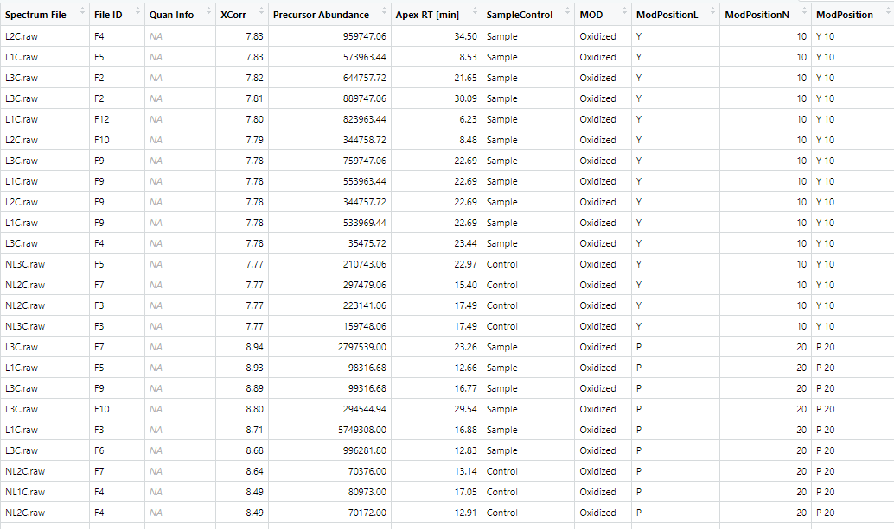
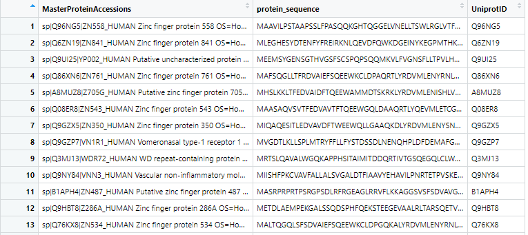
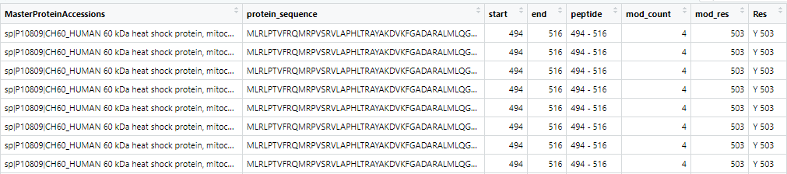
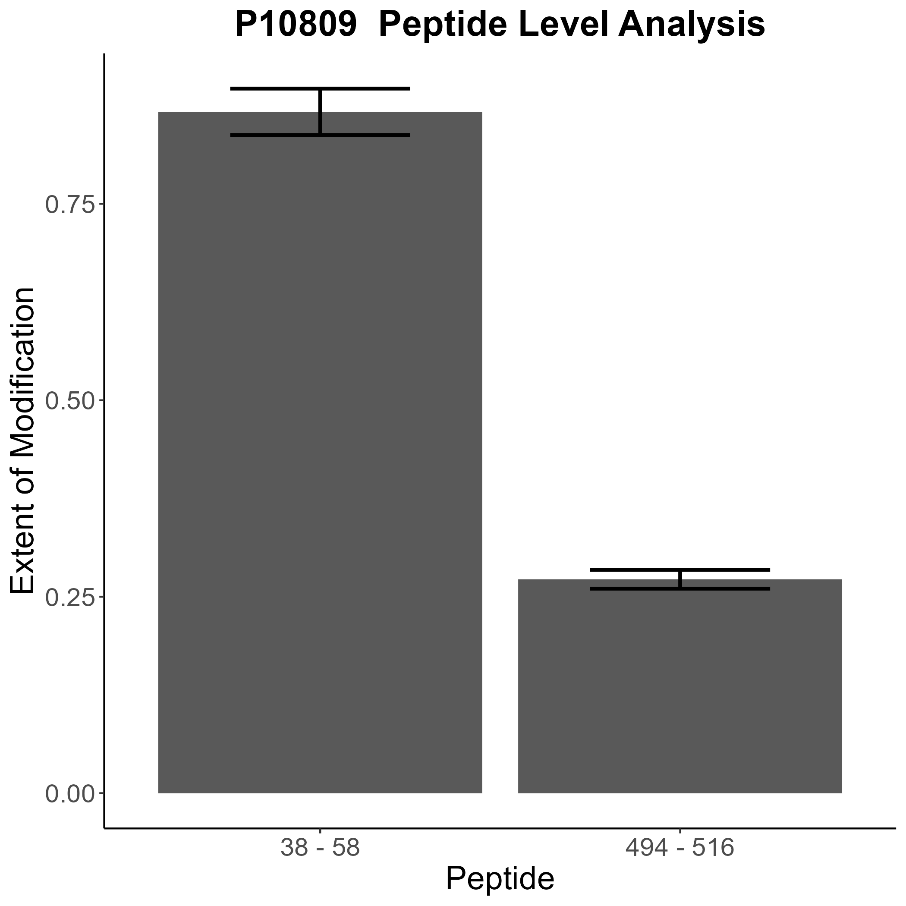
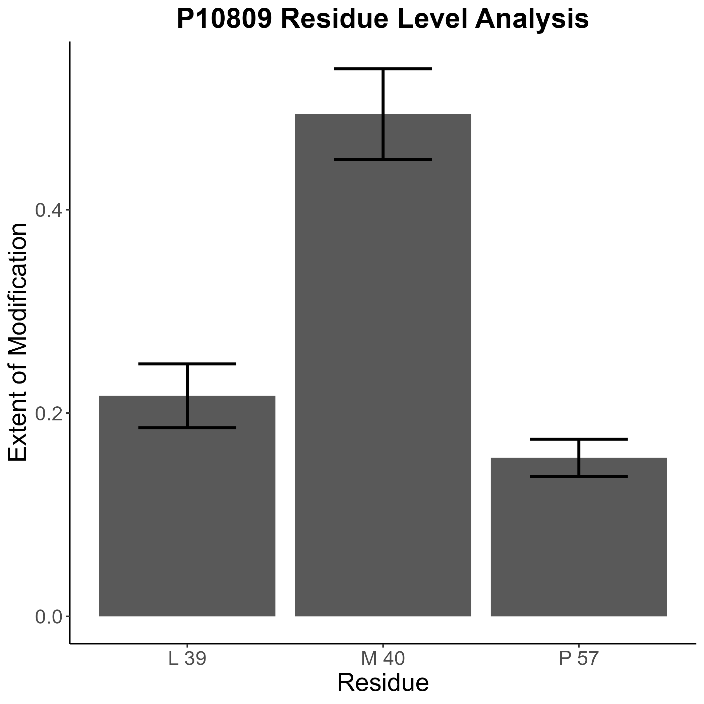

```{r, include = FALSE}
knitr::opts_chunk$set(
  collapse = TRUE,
  comment = "#>"
)
```

```{r setup}
library(coADAPTr)
```

# This is an introduction to coADAPTr (Covalent Labeling Automated Data Analysis Platform in R)

**Introduction to coADAPTr**

This document provides an overview of the coADAPTr package, which stands
for Covalent Labeling Automated Data Analysis Platform in R. coADAPTr is
designed to assist in the processing of raw mass spectrometry data that
has been sequence searched.

**Overview**

The package offers a series of functions to streamline the data analysis
workflow, from importing raw data to generating visualizations and
saving results.

The initial input is an excel sheet (.xlsx or .xls) that contains the
minimum columns: - Master Protein Accessions - Protein Accessions -
Modifications (Modification Type; Modification Position) - Sequence (If
using Proteome Discoverer 2.5\> be sure to change "Annotated Sequence'
to "Sequence") - Precursor Abundance - Spectrum File (Indicate Laser-L
vs No Laser-NL Samples in the Spectrum File Names) - Retention Time.

*Do not use the function remove_dup if your data comes from another
source or the duplicates have already been removed.*

## Analyzing Sequence Searched Data with coADAPTr

Before diving into the analysis, it's essential to ensure that all
necessary packages are installed and any potential conflicts are
resolved. The before_beginning() function handles this initialization
step:

before_beginning()

## Step-by-Step Guide

### Step 1: Read in Required Inputs

Start by reading in the necessary inputs for the analysis. This
typically includes a FASTA file containing protein sequences

FASTA \<- FASTA_file()

Select the appropriate FASTA file from the File Explorer prompt that
loads from your computer

### Step 2: Set Output Directory

Define the output directory where the results will be saved:

file_output \<- output_folder()

Select the appropriatefolder from the File Explorer prompt that loads
from your computer

### Step 3: Read in Data from Proteome Discoverer

Import the data from Proteome Discoverer using the import_data()
function:

The Excel file should contain the minimum columns:

-   MasterProteinAccessions

-   UniprotID

-   Modifications (Modification Type; Modification Position)

-   Sequence (If using Proteome Discoverer 2.5\> be sure to change
    "Annotated Sequence' to "Sequence")

-   Precursor Abundance

-   Spectrum File (Indicate Laser-L vs No Laser-NL Samples in the
    Spectrum File Names)

-   Retention Time

-   Identifying Node

*Note: If you only have the minimum required columns you may not be able
to use remove_dup()*

pd_data \<- import_data()

Select the appropriate excel file from the File Explorer prompt that
loads from your computer

{width="25in"}

### Step 4: Identify Sample and Control Spectrum Files

Determine which spectrum files correspond to the sample and control
groups based on the presence of L and NL in the spectrum file name using
the SampleControl() function:

pd_data \<- SampleControl(pd_data)

Input your original data frame into this function.

{width="533"}

### Step 5: Remove Duplicate Entries

If the MS files were analyzed via Proteome Discoverer, you can remove
duplicate entries using the remove_dup() function:

*Only run this if you have not removed the duplicates in Excel and your
data is from Proteome Discoverer 2.3-3.0 Specifically if you used
multilevel sequence searching algorithm.*

pd_data \<- remove_dup(pd_data)

Alternatively, you can select all of the data in excel and remove
duplicate in excels Data tab before importing the data into R.

### Step 6: Clean and Parse Data

Annotate the features in the data from the PD output file like
extracting the modification position using the annotate_features()
function:

pd_data_annotated \<- annotate_features(pd_data)

Input your raw data containing the SampleControl column into this
function



### Step 7: Parse the FASTA File

Parse the FASTA file to extract relevant information and rename the
column headers using the parse_fasta() function:

FASTA \<- parse_fasta(FASTA)



Input your FASTA file into this function

### Step 8: Locate Residue Numbers

Locate the residue numbers in the FASTA file using the
locate_startend_res() function:

pd_data_fasta_merged \<- locate_startend_res(pd_data_annotated)



Input your annotated raw data into this function.

**Step 9: Calculate Peptide Level Areas and Extent of Modification**

Calculate the peptide level areas and extent of modification using the
area_calculations_pep() function:

Areas_pep \<- area_calculations_pep(pd_data_fasta_merged)

Input your annotated data merged with your FASTA file into this
function.

### Step 10: Grab Sequence Meta Data (SKIP)

YOU DO NOT NEED TO MANUALLY DO THIS STEP AS IT USED IN THE NEXT FUNCTION

### Step 11: Merge Metada with Graphing Data

Merge the metadata (ie. the peptide and modification location) with the
graphing data using the merge_metadata() function:

graphing_df_pep \<- merge_metadata_pep(Areas_pep, pd_data_fasta_merged)

Input your data containing the peptide level EOM and the raw data that
was merged with the FASTA file into this function.

### Step 12: Filter Graphical Data

Filter the graphical data to include only acceptable data using the
filtered_graphing_df_pep() function:

quant_graph_df_pep \<- filtered_graphing_df_pep(graphing_df_pep)

Input your peptide level graphing data into this function.

### Step 13: Calculate Residue Level Areas and Extent of Modification

Calculate the residue level areas and extent of modification using the
area_calculations_res() function:

Areas_res \<- area_calculations_res(pd_data_fasta_merged)

Input your raw data merged with your FASTA file into this function.

### Step 14: Prepare Residue Level Graphing Data

Prepare the residue level graphing data by annotating the peptide and
residue location using the graphing_data_res() function:

graphing_df_res \<- graphing_data_res(Areas_res, pd_data_fasta_merged)

Input your containing the residue EOM and the raw data that was merged
with the FASTA file into this function.

### Step 15: Filter Residue Level Graphing Data

Filter the residue level graphing data for quantifiable modifications
using the filtered_graphing_df_res() function:

quant_graph_df_res \<- filtered_graphing_df_res(graphing_df_res)

Input your graphing residue level data into this function.

### Step 16: Save Tables and Plots

#### 16A: Create and Save the Tables and Plots Generated During the Analysis

TotalsTable\<- create_totals_tablelist (quant_graph_df_pep,
quant_graph_df_res)

{width="579"}

#### 16B: Save the Data Frames Generated During Analysis

save_data_frames(file_output, TotalsTable = TotalsTable,
quant_graph_df_pep = quant_graph_df_pep, quant_graph_df_res =
quant_graph_df_res, graphing_df_pep = graphing_df_pep, graphing_df_res =
graphing_df_res)

To save a data frame that is not listed simply add (dataframe =
dataframe) to the end of the comma separated list.

{width="396"}

#### 16C: Generate Peptide Level Bar Graphs

To generate the peptide level bar graphs use this function:

generate_eom_plot_pep(df_in = quant_graph_df_pep, file_output =
file_output)

{width="475"}

#### 16D: Generate Residue Level Bar Graphs

To generate the residue level bar graphs use generate_eom_plot_res():

generate_eom_plot_res(df_in = quant_graph_df_res, file_output =
file_output)

{width="528"}

### Step 17: Create and Save Venn Diagrams

Create and save venn diagrams using this function:

venn_diagram()

The excel workbook containing the information to place in the venn
diagram have a a column list of master protein accessions correlation to
a condition that is indicated in the header.

{width="462"}

### Step 18: Creating and Saving Grouped Bar Graphs.

Once you have analyzed data of different conditions, combine the
quantifiable graphing data into one data frame. In the last column
indicate which row corresponds to which condition. Then use this
function to create your grouped bar plot.

#### 18A Generate Peptide Level Grouped Bar Plot

grouped_bar_plot_pep()

The excel workbook containing the extent of modification for varying
conditions should look like this.

Once you analyzed data o difference conditions simply add a column
"Condition" as a column in excel sheet containing quantifiable
modifications. Then you can combine the two data frames together for
graphing.

{width="572"}

#### 18B Generate Residue Level Grouped Bar Plot

For residue level EOM grouped bar graphs use the following function:

grouped_bar_plot_res()

This vignette includes explanations and documentation for each step in
the data analysis workflow. It should serve as a comprehensive guide for
users of the `coADAPTr` package.
