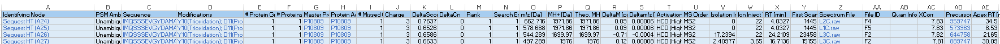

```{r, include = FALSE}
knitr::opts_chunk$set(
  collapse = TRUE,
  comment = "#>"
)
```

```{r setup}
library(coADAPTr)
```

# This is an introduction to coADAPTr (Covalent Labeling Automated Data Analysis Platform in R)

**Introduction to coADAPTr**

This document provides an overview of the coADAPTr package, which stands
for Covalent Labeling Automated Data Analysis Platform in R. coADAPTr is
designed to assist in the processing of raw mass spectrometry data that
has been sequence searched.

**Overview**

The package offers a series of functions to streamline the data analysis
workflow, from importing raw data to generating visualizations and
saving results.

The initial input is an excel sheet (.xlsx or .xls) that contains the
minimum columns: - MasterProteinAccessions - UniprotID - Modifications
(Modification Type; Modification Position) - Sequence (If using Proteome
Discoverer 2.5\> be sure to change "Annotated Sequence' to "Sequence") -
Precursor Abundance - Spectrum File (Indicate Laser-L vs No Laser-NL
Samples in the Spectrum File Names) - Retention Time. Do not use the
function remove_dup if your data comes from another source or the
duplicates have already been removed.

## Analyzing Sequence Searched Data with coADAPTr

Before diving into the analysis, it's essential to ensure that all
necessary packages are installed and any potential conflicts are
resolved. The before_beginning() function handles this initialization
step:

before_beginning()

## Step-by-Step Guide

### Step 1: Read in Required Inputs

Start by reading in the necessary inputs for the analysis. This
typically includes a FASTA file containing protein sequences

FASTA \<- FASTA_file()

### Step 2: Set Output Directory

Define the output directory where the results will be saved:

```{r eval=FALSE, include=FALSE}
file_output <- output_folder()
```

### Step 3: Read in Data from Proteome Discoverer

Import the data from Proteome Discoverer using the import_data()
function:

The Excel file should contain the minimum columns:

-   MasterProteinAccessions

-   UniprotID

-   Modifications (Modification Type; Modification Position)

-   Sequence (If using Proteome Discoverer 2.5\> be sure to change
    "Annotated Sequence' to "Sequence")

-   Precursor Abundance

-   Spectrum File (Indicate Laser-L vs No Laser-NL Samples in the
    Spectrum File Names)

-   Retention Time

-   Identifying Node

*Note: If you only have the minimum required columns you may not be able
to use remove_dup()*

pd_data \<- import_data()



### Step 4: Identify Sample and Control Spectrum Files

Determine which spectrum files correspond to the sample and control
groups using the SampleControl() function:

```{r eval=FALSE, include=FALSE}
pd_data <- SampleControl(pd_data)
```

### Step 5: Remove Duplicate Entries

If the MS files were analyzed via Proteome Discoverer, you can remove
duplicate entries using the remove_dup() function:

*Only run this if you have not removed the duplicates in Excel and your
data is from Proteome Discoverer 2.4-3.0 Specifically if you used
multilevel sequence searching algorithm.*

```{r eval=FALSE, include=FALSE}
pd_data <- remove_dup(pd_data)
```

### Step 6: Clean and Parse Data

Annotate the features in the data from the PD output file using the
annotate_features() function:

```{r eval=FALSE, include=FALSE}
pd_data_annotated <- annotate_features(pd_data)
```

### Step 7: Parse the FASTA File

Parse the FASTA file to extract relevant information using the
parse_fasta() function:

```{r eval=FALSE, include=FALSE}
FASTA <- parse_fasta(FASTA)
```

### Step 8: Locate Residue Numbers

Locate the residue numbers in the FASTA file using the
locate_startend_res() function:

```{r eval=FALSE, include=FALSE}
pd_data_fasta_merged <- locate_startend_res(pd_data_annotated)
```

**Step 9: Calculate Peptide Level Areas and Extent of Modification**

Calculate the peptide level areas and extent of modification using the
area_calculations_pep() function:

```{r eval=FALSE, include=FALSE}
Areas_pep <- area_calculations_pep(pd_data_fasta_merged)
```

### Step 10: Merge Metada with Graphing Data

Merge the metadata (ie. the peptide and modification location) with the
graphing data using the merge_metadata() function:

```{r eval=FALSE, include=FALSE}
graphing_df_pep <- merge_metadata_pep(Areas_pep, pd_data_fasta_merged)
```

### Step 11: Filter Graphical Data

Filter the graphical data to include only acceptable data using the
filtered_graphing_df_pep() function:

```{r eval=FALSE, include=FALSE}
quant_graph_df_pep <- filtered_graphing_df_pep(graphing_df_pep)
```

### Step 12: Calculate Residue Level Areas and Extent of Modification

Calculate the residue level areas and extent of modification using the
area_calculations_res() function:

```{r eval=FALSE, include=FALSE}
Areas_res <- area_calculations_res(pd_data_fasta_merged)
```

### Step 13: Prepare Residue Level Graphing Data

Prepare the residue level graphing data by annotating the peptide and
residue location using the graphing_data_res() function:

```{r eval=FALSE, include=FALSE}
graphing_df_res <- graphing_data_res(Areas_res, pd_data_fasta_merged)
```

### Step 14: Filter Residue Level Graphing Data

Filter the residue level graphing data for quantifiable modifications
using the filtered_graphing_df_res() function:

```{r eval=FALSE, include=FALSE}
quant_graph_df_res <- filtered_graphing_df_res(graphing_df_res)
```

### Step 15: Save Tables and Plots

Create and save the tables and plots generated during the analysis using
the save_data_frames() function: generate_eom_plot_pep()
generate_eom_plot_res()

```{r eval=FALSE, include=FALSE}
TotalsTable<- create_totals_tablelist (quant_graph_df_pep, quant_graph_df_res)
```

```{r eval=FALSE, include=FALSE}
save_data_frames(file_output, TotalsTable = TotalsTable, quant_graph_df_pep = quant_graph_df_pep, quant_graph_df_res = quant_graph_df_res, graphing_df_pep = graphing_df_pep, graphing_df_res = graphing_df_res)
```

```{r eval=FALSE, include=FALSE}
generate_eom_plot_pep(df_in = quant_graph_df_pep, file_output = file_output)
```

```{r eval=FALSE, include=FALSE}
generate_eom_plot_res(df_in = quant_graph_df_res, file_output = file_output)
```

This vignette includes explanations and documentation for each step in
the data analysis workflow. It should serve as a comprehensive guide for
users of the `coADAPTr` package.
