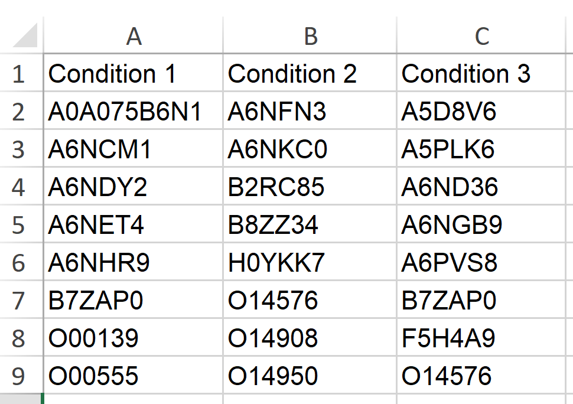

```{r, include = FALSE}
knitr::opts_chunk$set(
  collapse = TRUE,
  comment = "#>"
)
```

```{r setup}
library(coADAPTr)
```

# This is an introduction to coADAPTr (Covalent Labeling Automated Data Analysis Platform in R)

**Introduction to coADAPTr**

This document provides an overview of the coADAPTr package, which stands
for Covalent Labeling Automated Data Analysis Platform in R. coADAPTr is
designed to assist in the processing of raw mass spectrometry data that
has been sequence searched.

**Overview**

The package offers a series of functions to streamline the data analysis
workflow, from importing raw data to generating visualizations and
saving results.

The initial input is an excel sheet (.xlsx or .xls) that contains the
minimum columns: - Master Protein Accessions - Modifications
(Modification Type; Modification Position - Sequence or Peptide (If
using Proteome Discoverer 2.5\> be sure to change "Annotated Sequence'
to "Sequence") - Precursor Abundance/Intensity - Spectrum File (Or any
columns that can be used to separate sample types such as Experimental
Condition and Laser vs No Laser).

If using PD 2.0-3.0 please import all data and run the remove_dup()
function to get ride of duplicates created by the multilevel sequence
searching method described in [Rinas et al.
2016](https://link.springer.com/article/10.1007/s00216-016-9369-3 "An efficient quantitation strategy for hydroxyl radical-mediated protein footprinting using Proteome Discoverer").

*Do not use the function remove_dup if your data comes from another
source or the duplicates have already been removed in excel.*

## Analyzing Sequence Searched Data with coADAPTr

*Before diving into the analysis, it's essential to ensure that your
sequence searched data is in an excel.This package only supports excel
inputs not csv.*

## Step-by-Step Guide for LFQ Data Analysis

Please see this video where coADAPTR was used to analyze LFQ data to
compliment this step-by-step guide

### Step 1: Load Necessary Packages and Data

Before Analyzing your data be sure to run this function to install
necessary packages, resolve package conflicts, import required data, and
select result output folders. ***Follow the console prompts and
anticipate File Explorer pop ups.***

**setup()**

[To elaborate, the following functions are wrapped into one sequence
which is called setup().]{.underline}

1.  before_beginning()--Installs required packages and resolved
    conflicts.
2.  raw_data \<\<- import_data()--Allows the user to select (via file
    explorer) and import the excel file containing their data.
3.  file_output \<\<- output_folder()--Allows the user to select (via
    file explorer) the folder they want the data stored in.
4.  FASTA \<\<- FASTA_file()--Allows the user to select (via file
    explorer) and import the FASTA file in .fasta format of which the
    data was searched.

### Step 2: Prepare the LFQ Data for Analysis

Prepare your LFQ data for analysis by selecting the relevant data,
renaming the columns appropriately, and searching the FASTA file against
peptide spectral matches to identify the start and end residues.
***Follow the console prompts and anticipate File Explorer pop ups.***

**LFQ_Prep()**

[To elaborate, the following functions are wrapped into one sequence
which is called LFQ Prep().]{.underline}

1.  selected_data \<\<- column_selectionLFQ(raw_data)--Prompts the user
    to select the columns corresponding to the request.
2.  modified_data \<\<- rename_and_split_spectrum_files(selected_data)
    --Prompts the user to select and rename the column containing
    Spectrum File or a similar identifier in the format of
    **Condition:Sample Type & \#**. (*ex. Drug Treated:NL1, Drug
    Free:L3, or Outer Region:L2*). Then the Spectrum file column is
    split so Condition is in one column leaving sample type information
    in the Spectrum File column.
3.  modified_data \<\<- SampleControl(modified_data)--Detects sample vs
    control files based on the Spectrum File Column.
4.  modified_data_annotated \<\<-
    annotate_features(modified_data)--Identifies the modification
    position on the peptide based off of input in modification column.
5.  FASTA\<\<- parse_fasta(FASTA)--Parses the FASTA file for relevant
    information to map the modification on the protein sequence.
6.  mod_data_fasta_merged\<\<-
    locate_startend_res(modified_data_annotated, FASTA)--Maps the
    modification to the protein sequence after merging the FASTA file
    with the data.

### Step 3: Calculate the Extent of Modification

Calculate the Extent of Modification (EOM) for each peptide and residue
based on the LFQ data.

**EOM_Calculations()**

*The data frame **quant_graph_df** contains all of the data that is
acceptable for graphing.*

*The data frame **Areas_pep** and **Areas_res** contain the data that is
used to calculate the EOM and will contain all data. This includes cases
where the EOM could be negative (high background oxidation) or the SD is
greater than the EOM (data has a high variance-likely due to
experimental conditions)*

[To elaborate, the following functions are wrapped into one sequence
which is called EOM_Calculations().]{.underline}

Areas_pep\<\<- area_calculations_pep(mod_data_fasta_merged)--Calculates
the Extent of Modification (EOM) and SD (Variance) at the peptide level

graphing_df_pep\<\<- merge_metadata_pep(Areas_pep,
mod_data_fasta_merged)-- Merges the metadata with numeric graphing data

quant_graph_df_pep\<\<-
filtered_graphing_df_pep(graphing_df_pep)--Filters peptide level
graphical data to include data that is acceptable

Areas_res\<\<- area_calculations_res(mod_data_fasta_merged)--Calculates
the Extent of Modification (EOM) and SD (Variance) at the residue level

graphing_df_res\<\<- graphing_data_res(Areas_res,
mod_data_fasta_merged)--Subsets sequence metadata like residue
start/stop for residue level data

quant_graph_df_res\<\<-
filtered_graphing_df_res(graphing_df_res)--Filter residue level
graphical data to include data that is acceptable

### Step 4: Save ALL Tables and Graphs

Save data frames as Excel files and save grouped bar from the plots as
PNG files. ***Follow the console prompts and anticipate File Explorer
pop ups.***

Tables_and_Graphs()

[To elaborate, the following functions are wrapped into one sequence
which is called Tables_and_Graphs().]{.underline}

TotalsTable\<\<-create_totals_tablelist(graphing_df_pep,
graphing_df_res)--Creates a table of totals for general and quantifiable
modifications

save_data_frames(file_output, TotalsTable = TotalsTable, Areas_pep =
Areas_pep, quant_graph_df_pep = quant_graph_df_pep, Areas_res =
Areas_res, quant_graph_df_res = quant_graph_df_res, graphing_df_pep =
graphing_df_pep, graphing_df_res = graphing_df_res)--Saves Data Frames
as Excel Files

generate_grouped_bar_plot_pep()--Generates the grouped bar plots for
peptide level data and allows user to define folder name and location of
graphs

generate_grouped_bar_plot_res()--Generates the grouped bar plots for
residue level data and allows user to define folder name and location of
graphs

count_peptides_per_protein() &
count_residue_entries_per_protein()--Counts the modified peptides and
residues per protein and allows the user to define the file and
graphical headers.

### Step 5: If Desired Create Venn Diagrams

venn_diagram()

The excel workbook containing the information to place in the venn
diagram have a a column list of master protein accessions correlation to
a condition that is indicated in the header.

{width="495"}

## Step-by-Step Guide for TMT Data Analysis

### Step 1: Load Necessary Packages and Data

Before Analyzing your data be sure to run this function to install
necessary packages, resolve package conflicts, import required data, and
select result output folders. ***Follow the console prompts and
anticipate File Explorer pop ups.***

**setup()**

[To elaborate, the following functions are wrapped into one sequence
which is called setup().]{.underline}

1.  before_beginning()--Installs required packages and resolved
    conflicts.
2.  raw_data \<\<- import_data()--Allows the user to select (via file
    explorer) and import the excel file containing their data.
3.  file_output \<\<- output_folder()--Allows the user to select (via
    file explorer) the folder they want the data stored in.
4.  FASTA \<\<- FASTA_file()--Allows the user to select (via file
    explorer) and import the FASTA file in .fasta format of which the
    data was searched.

### Step 2: Normalize the TMT Data

Prepare your TMT data for analysis by normalizing the TMT abundances and
allow you to rename the required columns accordingly. This prepares the
data for annotation  ***Follow the console prompts and anticipate File
Explorer pop ups.***

**TMT_Quant()**

[To elaborate, the following functions are wrapped into one sequence
which is called LFQ Prep().]{.underline}

1.  TMT_data \<\<- sum_and_calculate_abundancesTMT(raw_data)--Summarize
    and Calculate the Normalized TMT Abundances
2.  selected_data \<\<- column_selectionTMT(TMT_data)--Allows the user
    to select the required TMT columns
3.  renamed_data \<\<-
    rename_columns_interactively(selected_data)--Allows the user to
    rename the TMT columns to reflect the conditions and sample types
4.  transformed_data \<\<- transform_data(renamed_data)--Transforms the
    data to a format that can be used for further analysis
5.  transformed_data \<\<- SampleControl(transformed_data)--Identifies
    Sample vs Control Files

### Step 3: Prepare the TMT Data for Analysis

Prepare your TMT data for analysis by selecting the relevant data,
renaming the columns appropriately, and searching the FASTA file against
peptide spectral matches to identify the start and end residues.
***Follow the console prompts and anticipate File Explorer pop ups.***

**TMT_Prep**

[To elaborate, the following functions are wrapped into one sequence
which is called LFQ Prep().]{.underline}

1.  annotated_data \<\<- annotate_features(transformed_data)--Identifies
    the modification position on the peptide based off of input in
    modification column.
2.  FASTA\<\<- parse_fasta(FASTA)--Parses the FASTA file for relevant
    information to map the modification on the protein sequence.
3.  mod_data_fasta_merged\<\<- locate_startend_res(annotated_data,
    FASTA)--Maps the modification to the protein sequence after merging
    the FASTA file with the data.
4.  mod_data_fasta_merged\<\<-
    split_spectrum_filesTMT(mod_data_fasta_merged)--Separates the
    Spectrum File column to create a new column called Condition
    containing the experimental condition entered while leaving the
    Sample Type in the Spectrum File column.

### Step 4: Calculate the Extent of Modification

Calculate the Extent of Modification (EOM) for each peptide and residue
based on the LFQ data.

**EOM_Calculations()**

*The data frame **quant_graph_df** contains all of the data that is
acceptable for graphing.*

*The data frame **Areas_pep** and **Areas_res** contain the data that is
used to calculate the EOM and will contain all data. This includes cases
where the EOM could be negative (high background oxidation) or the SD is
greater than the EOM (data has a high variance-likely due to
experimental conditions)*

[To elaborate, the following functions are wrapped into one sequence
which is called EOM_Calculations().]{.underline}

Areas_pep\<\<- area_calculations_pep(mod_data_fasta_merged)--Calculates
the Extent of Modification (EOM) and SD (Variance) at the peptide level

graphing_df_pep\<\<- merge_metadata_pep(Areas_pep,
mod_data_fasta_merged)-- Merges the metadata with numeric graphing data

quant_graph_df_pep\<\<-
filtered_graphing_df_pep(graphing_df_pep)--Filters peptide level
graphical data to include data that is acceptable

Areas_res\<\<- area_calculations_res(mod_data_fasta_merged)--Calculates
the Extent of Modification (EOM) and SD (Variance) at the residue level

graphing_df_res\<\<- graphing_data_res(Areas_res,
mod_data_fasta_merged)--Subsets sequence metadata like residue
start/stop for residue level data

quant_graph_df_res\<\<-
filtered_graphing_df_res(graphing_df_res)--Filter residue level
graphical data to include data that is acceptable

### Step 5: Save ALL Tables and Graphs

Save data frames as Excel files and save grouped bar from the plots as
PNG files. ***Follow the console prompts and anticipate File Explorer
pop ups.***

Tables_and_Graphs()

[To elaborate, the following functions are wrapped into one sequence
which is called Tables_and_Graphs().]{.underline}

TotalsTable\<\<-create_totals_tablelist(graphing_df_pep,
graphing_df_res)--Creates a table of totals for general and quantifiable
modifications

save_data_frames(file_output, TotalsTable = TotalsTable, Areas_pep =
Areas_pep, quant_graph_df_pep = quant_graph_df_pep, Areas_res =
Areas_res, quant_graph_df_res = quant_graph_df_res, graphing_df_pep =
graphing_df_pep, graphing_df_res = graphing_df_res)--Saves Data Frames
as Excel Files

generate_grouped_bar_plot_pep()--Generates the grouped bar plots for
peptide level data and allows user to define folder name and location of
graphs

generate_grouped_bar_plot_res()--Generates the grouped bar plots for
residue level data and allows user to define folder name and location of
graphs

count_peptides_per_protein() &
count_residue_entries_per_protein()--Counts the modified peptides and
residues per protein and allows the user to define the file and
graphical headers.

### Step 6: If Desired Create Venn Diagrams

venn_diagram()

The excel workbook containing the information to place in the venn
diagram have a a column list of master protein accessions correlation to
a condition that is indicated in the header.

{width="462"}

## Troubleshooting

coADAPTr only accepts excel files in the form of .xlsx or .xl. Please
convert .csv files before loading into R.

Errors will present in the console of required information is not
present. BE sure to follow the console instructions closely as once
certain workflows are started they can't be stopped unless you start
over.

If you see NA's present in your extent of modification graphs, this
likely indicates cases where peptides were in the raw data but not
matched to an entry in your FASTA file. To avoid this be sure no decoy
entries are present in your final data set.
